# BÀI 2: MÃ HOÁ, TRIỂN KHAI PKI

- **Họ và tên:** ........................................
- **MSSV:** ........................................
- **Lớp:** ........................................
- **Môn:** Thực hành An toàn thông tin
- **Repository:** https://github.com/<username>/<ten-repo>

---

## 1. Mục tiêu

Bài thực hành gồm hai phần:

1. **crypto-toolkit** – xây dựng thư viện mã hoá riêng `securecrypto` bằng Python: mã hoá/giải mã file bằng AES-256-GCM (khoá dẫn xuất từ mật khẩu bằng PBKDF2-HMAC-SHA256), tạo cặp khoá RSA, ký số và xác thực chữ ký (RSA-PSS + SHA-256), băm mật khẩu an toàn bằng Argon2. Thư viện được dùng qua 3 giao diện: CLI, GUI (Tkinter) và REST API (Flask).
2. **mini-ca** – mô phỏng hệ thống Certificate Authority với chứng chỉ X.509: tạo Root CA, Intermediate CA, phát hành chứng chỉ người dùng cuối, xác thực chuỗi chứng chỉ, thu hồi chứng chỉ (CRL) và kiểm tra trạng thái (mô phỏng OCSP).

## 2. Môi trường

| Thành phần | Phiên bản |
|---|---|
| Hệ điều hành | Windows 10/11 |
| Python | 3.x |
| Thư viện | `cryptography`, `argon2-cffi`, `flask`, `pytest` |
| Công cụ | VS Code, curl, Git |

## 3. Cấu trúc thư mục

```
Bai2/
├── crypto-toolkit/
│   ├── files/
│   │   └── data.txt              # nội dung: HUTECH University
│   ├── securecrypto/
│   │   ├── __init__.py           # __version__ = "0.1.0"
│   │   ├── aes_utils.py          # mã hoá / giải mã AES-256-GCM
│   │   ├── hash_utils.py         # băm mật khẩu Argon2
│   │   ├── rsa_utils.py          # sinh khoá, ký, xác thực RSA
│   │   ├── cli.py                # giao diện dòng lệnh
│   │   ├── app_gui.py            # giao diện Tkinter
│   │   └── api.py                # REST API Flask
│   ├── tests/
│   │   ├── test_aes_utils.py
│   │   ├── test_hash_utils.py
│   │   └── test_rsa_utils.py
│   ├── requirements.txt
│   └── setup.py
└── mini-ca/mini-ca/
    ├── ca_utils.py               # tạo Root/Intermediate CA, phát hành & xác thực chứng chỉ
    ├── revoke_utils.py           # CRL: thu hồi & kiểm tra trạng thái
    ├── demo.py                   # chạy toàn bộ kịch bản trên terminal
    ├── demo_ui.py                # giao diện Tkinter
    └── requirements.txt
```

---

## 4. Phần 1 – crypto-toolkit

### 4.1 Các chức năng

| Hàm | Mô tả |
|---|---|
| `encrypt_file_aes(filepath, password)` | Sinh salt 16 byte, dẫn xuất khoá 32 byte bằng PBKDF2 (100.000 vòng), mã hoá bằng AES-GCM với nonce 12 byte, ghi `salt + nonce + ciphertext` ra file `.enc`, trả về khoá dạng Base64 |
| `decrypt_file_aes(encrypted_file, key_base64)` | Tách salt/nonce/ciphertext, giải mã bằng khoá Base64, ghi ra file `.dec` |
| `generate_rsa_keypair(key_size)` | Tạo cặp khoá RSA (mặc định 2048 bit, e = 65537) |
| `sign_data_rsa(data, private_key)` | Ký dữ liệu bằng RSA-PSS + SHA-256 |
| `verify_signature_rsa(data, signature, public_key)` | Xác thực chữ ký, trả về `True/False` |
| `hash_password_secure(password)` | Băm mật khẩu bằng Argon2 |

### 4.2 Cài đặt package

```powershell
cd crypto-toolkit
pip install -r requirements.txt
pip install -e .
```

Lệnh `pip install -e .` cài `securecrypto` ở chế độ editable và tạo lệnh `securecrypto-cli`.

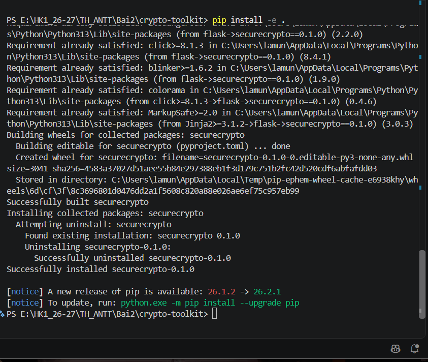

### 4.3 Chạy Unit Test

```powershell
pytest tests/
```

Kết quả: **8 passed** – toàn bộ test AES, Argon2 và RSA đều đạt (gồm cả trường hợp sai mật khẩu và dữ liệu bị sửa).

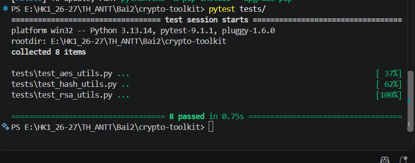

### 4.4 Mã hoá / giải mã qua CLI

```powershell
securecrypto-cli --encrypt .\files\data.txt --password <mat_khau>
```

Lệnh in ra khoá Base64 và tạo file `files/data.txt.enc` (nội dung không đọc được).

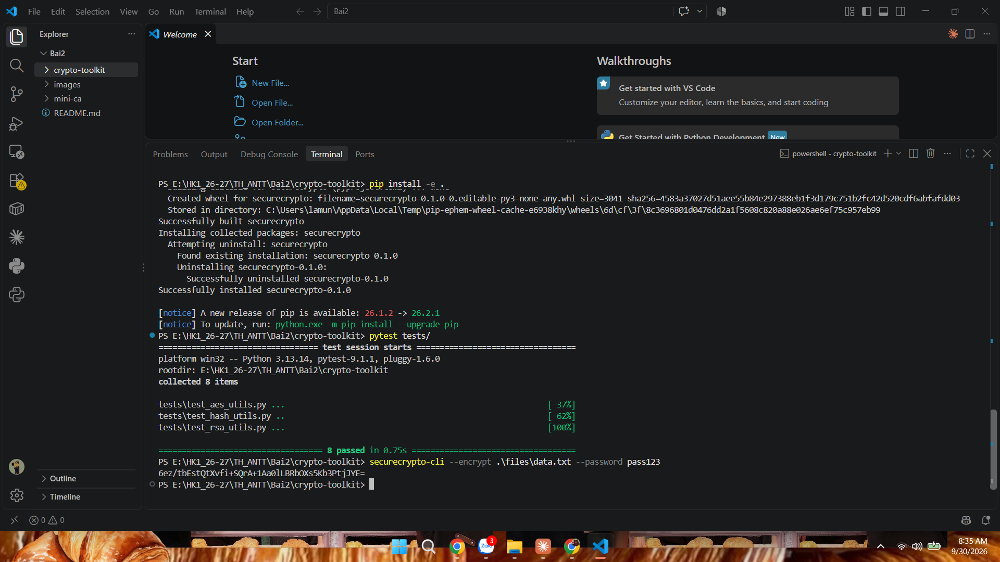

```powershell
securecrypto-cli --decrypt .\files\data.txt.enc --password <khoa_base64_vua_nhan>
```

File `files/data.txt.dec` chứa lại nội dung gốc `HUTECH University`.

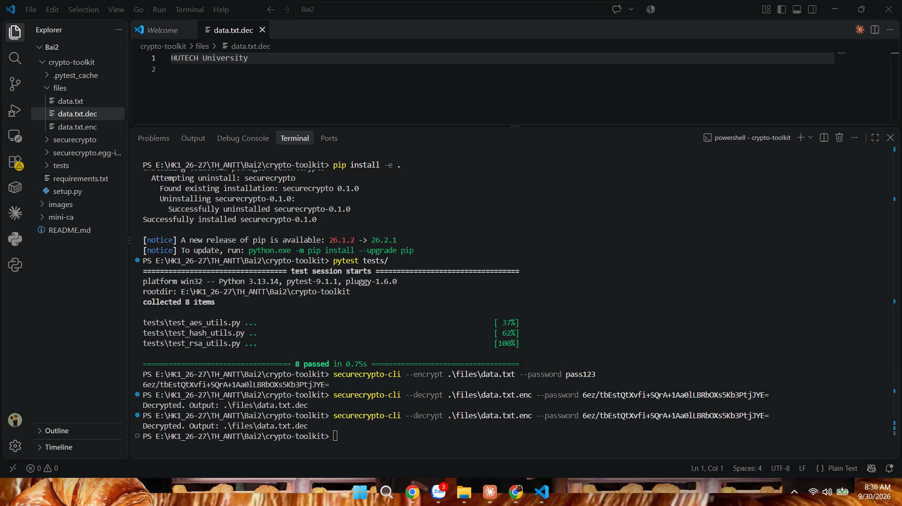

### 4.5 Mã hoá / giải mã qua GUI

```powershell
python securecrypto/app_gui.py
```

- **Encrypt:** nhập mật khẩu → bấm *Encrypt* → chọn file → nhận Key.
- **Decrypt:** dán Key vào ô nhập → bấm *Decrypt* → chọn file `.enc` → nhận file `.dec`.

**Cải tiến so với sách (phần sinh viên tự DEBUG):**

- Kiểm tra mật khẩu rỗng trước khi mã hoá, bỏ qua khi bấm *Cancel* ở hộp chọn file.
- Tự động copy Key vào clipboard, in Key ra terminal và điền sẵn Key vào ô nhập để giải mã (Label của Tkinter không bôi đen/copy được).
- Bắt lỗi `InvalidTag` khi dùng sai Key hoặc file bị sửa, hiện thông báo *"Sai Key/mật khẩu hoặc file đã bị sửa"* thay vì crash.

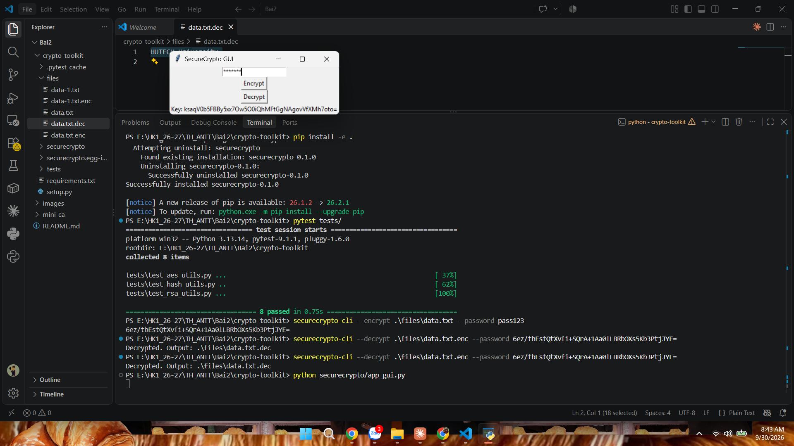
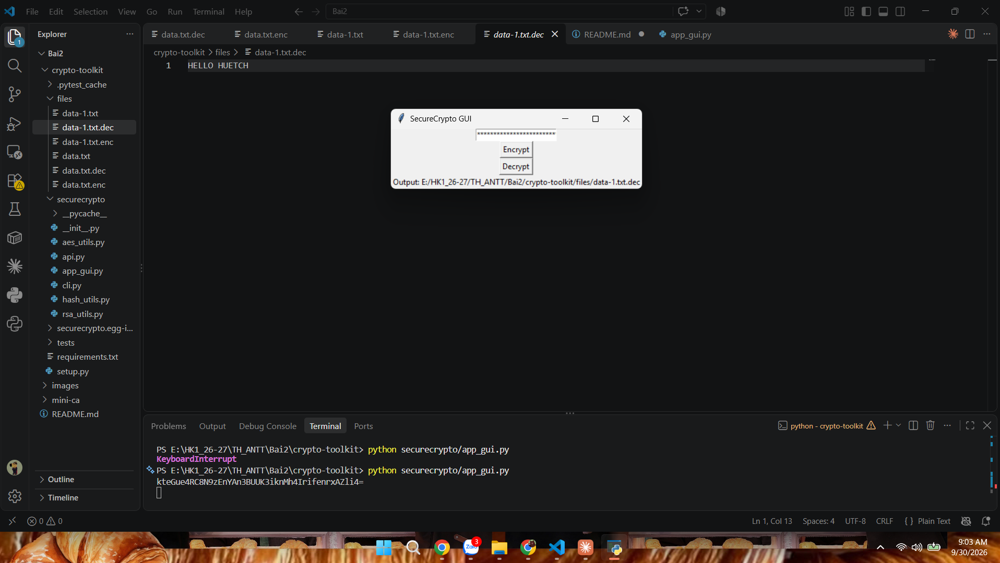

### 4.6 REST API (Flask) + curl

```powershell
python securecrypto/api.py
```

Server chạy tại `http://127.0.0.1:5000`. Dòng `WARNING: This is a development server` là thông báo mặc định của Flask, không ảnh hưởng khi chạy cục bộ. API chỉ có 2 route POST nên truy cập `/` bằng trình duyệt sẽ trả về 404 (bình thường).

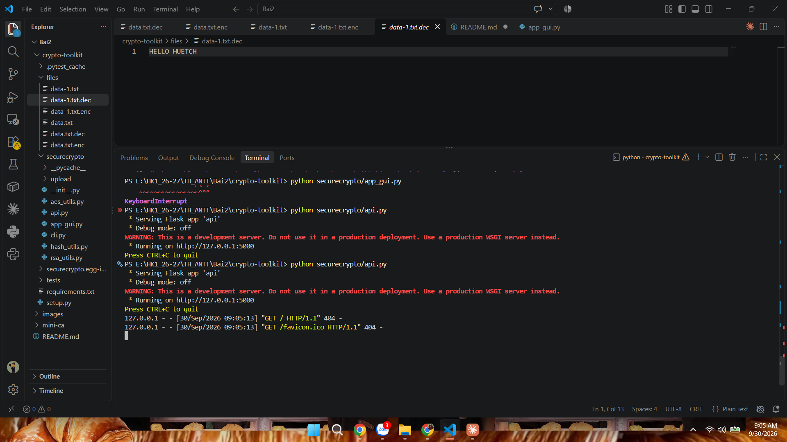

| Endpoint | Method | Body (form-data) | Kết quả |
|---|---|---|---|
| `/encrypt` | POST | `file` (File), `password` (Text) | `{"key": "<base64>"}` |
| `/decrypt` | POST | `file` (file `.enc`), `password` (= key nhận được) | `{"output": "<đường dẫn file .dec>"}` |

Mở terminal thứ hai (server vẫn chạy ở terminal thứ nhất) và gửi request bằng `curl`:

```powershell
curl.exe -X POST -F "file=@files/data.txt" -F "password=pass123" http://127.0.0.1:5000/encrypt
# => {"key":"iCaLIo5QAX+b1NHrLPdmwUekISApZ72MReND6sPgIUM="}

curl.exe -X POST -F "file=@securecrypto/upload/data.txt.enc" -F "password=<key>" http://127.0.0.1:5000/decrypt
# => {"output":"data.txt.dec"}
```

File upload và file kết quả được lưu trong `securecrypto/upload/`.

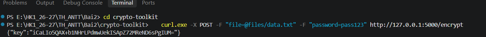
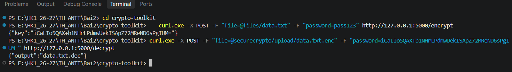
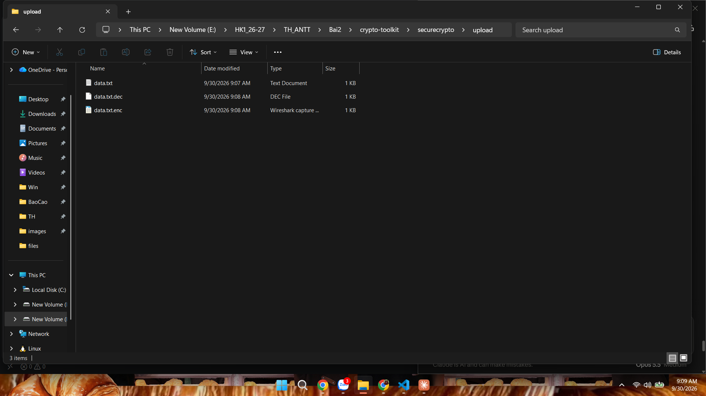

---

## 5. Phần 2 – mini-ca

### 5.1 Các chức năng

| Hàm | Mô tả |
|---|---|
| `create_root_ca()` | Tạo Root CA tự ký, hiệu lực 10 năm, `BasicConstraints(ca=True, path_length=1)` |
| `create_intermediate_ca(root_key, root_cert)` | Tạo CA trung gian do Root CA ký, hiệu lực 5 năm, `path_length=0` |
| `issue_certificate(ca_key, ca_cert, subject_info)` | Phát hành chứng chỉ end-entity, hiệu lực 1 năm, `ca=False` |
| `verify_certificate_chain(cert, chain)` | Xác thực chữ ký lần lượt qua từng cấp của chuỗi |
| `revoke_certificate(cert_file, issuer_cert_file, issuer_key_file, reason)` | Thêm serial number vào CRL (`certs/ca_crl.pem`) |
| `check_revocation_status(cert_file)` | Kiểm tra serial có trong CRL không (mô phỏng OCSP) |

Chuỗi tin cậy: **Root CA → Intermediate CA → Phuoc_Nguyen (end-entity)**.

### 5.2 Cài đặt

```powershell
cd mini-ca\mini-ca
pip install -r requirements.txt
```

### 5.3 Chạy kịch bản trên terminal

```powershell
python .\demo.py
```

Kết quả mong đợi:

```
Tạo Root CA...
Tạo Intermediate CA...
Phát hành chứng chỉ người dùng cuối...
Đã phát hành: certs\Phuoc_Nguyen_cert.pem, certs\Phuoc_Nguyen_key.pem
Kiểm tra chuỗi chứng chỉ...
Chuỗi hợp lệ: True
Thu hồi chứng chỉ user1...
Đã thu hồi
Kiểm tra trạng thái OCSP của Phuoc_Nguyen_cert.pem...
Trạng thái: Revoked
```

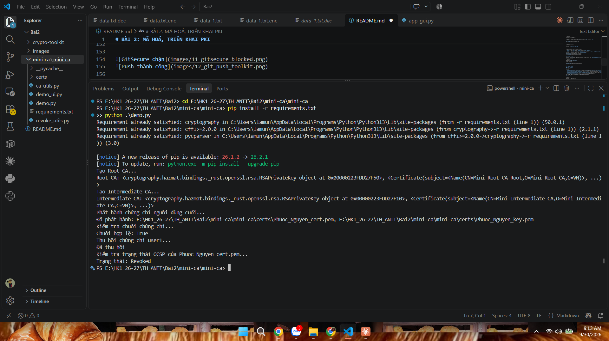


### 5.4 Chạy giao diện

```powershell
python .\demo_ui.py
```

Thực hiện lần lượt các nút: **1. Tạo Root & Intermediate CA → 2. Phát hành User Cert → 3. Kiểm tra Chuỗi Cert → 4. Thu hồi User Cert → 5. Kiểm tra Trạng thái OCSP**.

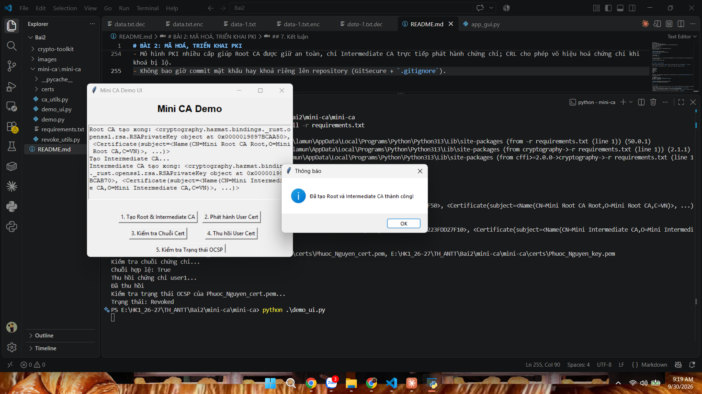

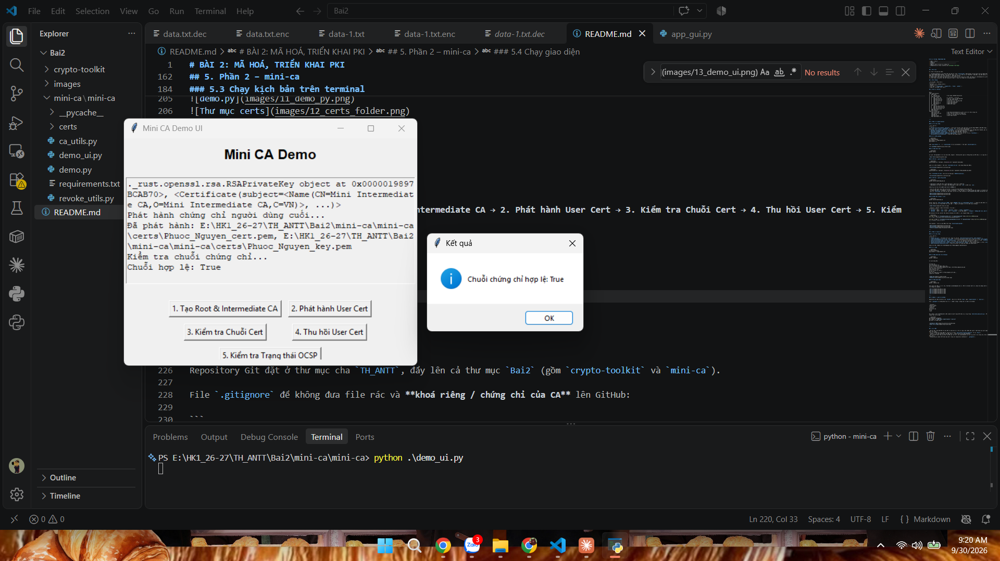
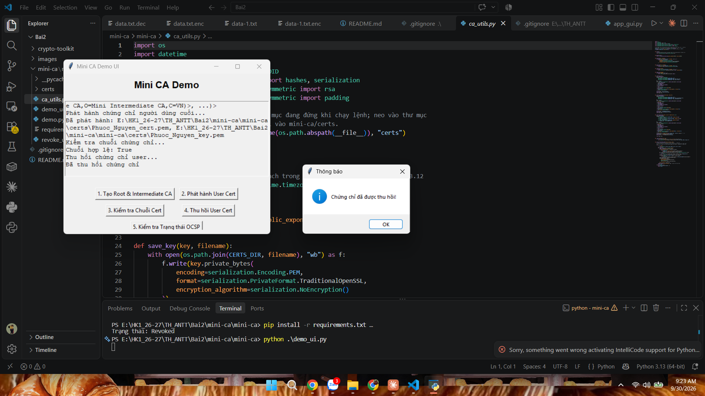
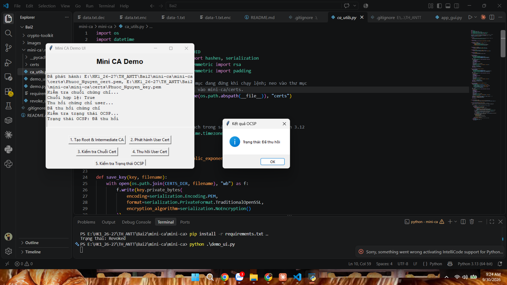

---

## 6. Commit và push lên GitHub

Repository Git đặt ở thư mục cha `TH_ANTT`, đẩy lên cả thư mục `Bai2` (gồm `crypto-toolkit` và `mini-ca`).

File `.gitignore` để không đưa file rác và **khoá riêng / chứng chỉ của CA** lên GitHub:

```
__pycache__/
.pytest_cache/
*.egg-info/
.DS_Store
gitsecure.log
certs/
*.pem
```

Khi commit, hook **GitSecure** chặn commit do phát hiện mật khẩu viết cứng trong `tests/test_hash_utils.py`. Đã xoá chuỗi mật khẩu nhạy cảm rồi commit lại thành công.

```powershell
git add Bai2 .gitignore
git commit -m "[add] Bai2 crypto-toolkit + mini-ca"
git push -u origin main
```


---

## 7. Kết luận

- Mã hoá đối xứng AES-GCM vừa bảo mật vừa đảm bảo toàn vẹn dữ liệu; khoá được dẫn xuất từ mật khẩu kèm salt ngẫu nhiên nên mỗi lần mã hoá cho ra khoá khác nhau.
- Chữ ký số RSA phát hiện được dữ liệu bị sửa (test `test_verify_invalid_signature` trả về `False`).
- Argon2 là lựa chọn phù hợp để lưu mật khẩu vì chống brute-force bằng GPU/ASIC.
- Mô hình PKI nhiều cấp giúp Root CA được giữ an toàn, chỉ Intermediate CA trực tiếp phát hành chứng chỉ; CRL cho phép vô hiệu hoá chứng chỉ khi khoá bị lộ.
- Không bao giờ commit mật khẩu hay khoá riêng lên repository (GitSecure + `.gitignore`).